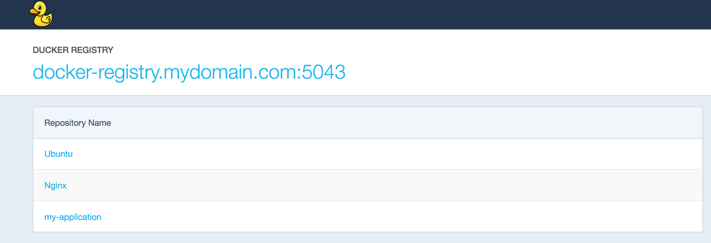
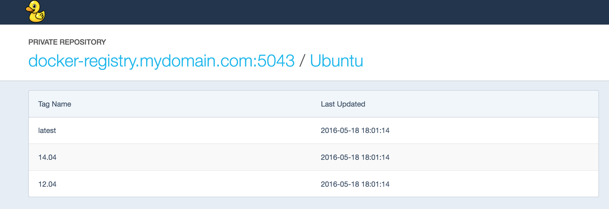
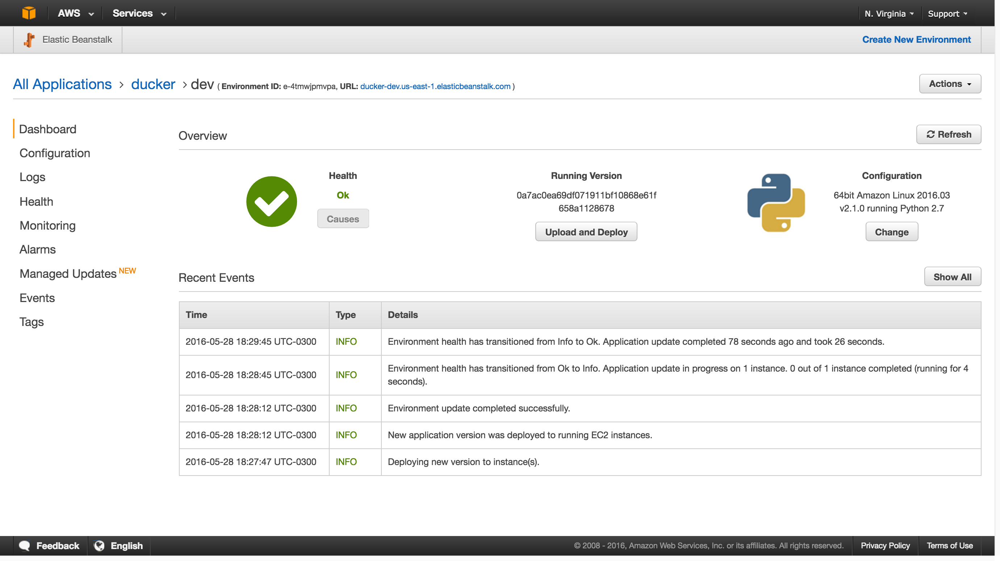

# Ducker 
A cheap and cheerful UI for private Docker registry. Uses Docker v2 API to pull registry manifests with a Python Flask application. Can be deployed on AWS Elastic Beastalk.

## Running

```shell
$ git clone https://github.com/justinkamerman/ducker.git
$ cd ducker
$ export DOCKER_REGISTRY_URL=http://my.docker.registry:5043
$ export DOCKER_REGISTRY_USER=reguser
$ export DOCKER_REGISTRY_PASSWORD=mypass
$ python application.py 
 * Running on http://127.0.0.1:5000/ (Press CTRL+C to quit)
```







## Deploying on Beanstalk
Deploy zip file to Elastic Beanstalk preconfigured Python 2.7 environment. Set environment variables via AWS console. 

```shell
$ make 
zip -r ducker.zip application.py requirements.txt static templates
  adding: application.py (deflated 68%)
  adding: requirements.txt (deflated 19%)
  adding: static/ (stored 0%)
  adding: static/font-awesome.min.css (deflated 77%)
  adding: static/main-0-02215d079ab2d50d8988.css (deflated 80%)
  adding: static/main.css (deflated 86%)
  adding: static/mini-logo.png (deflated 0%)
  adding: templates/ (stored 0%)
  adding: templates/reg.htm (deflated 76%)
  adding: templates/repo.htm (deflated 79%)
```

